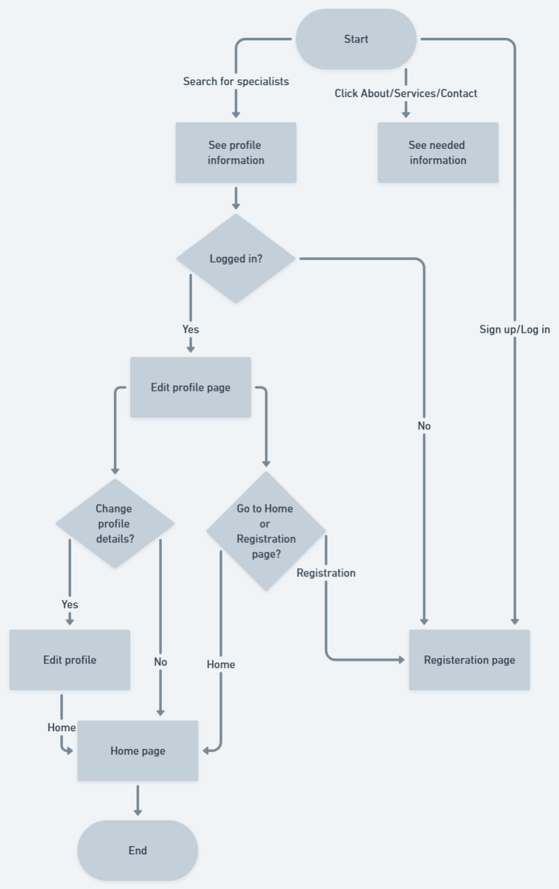
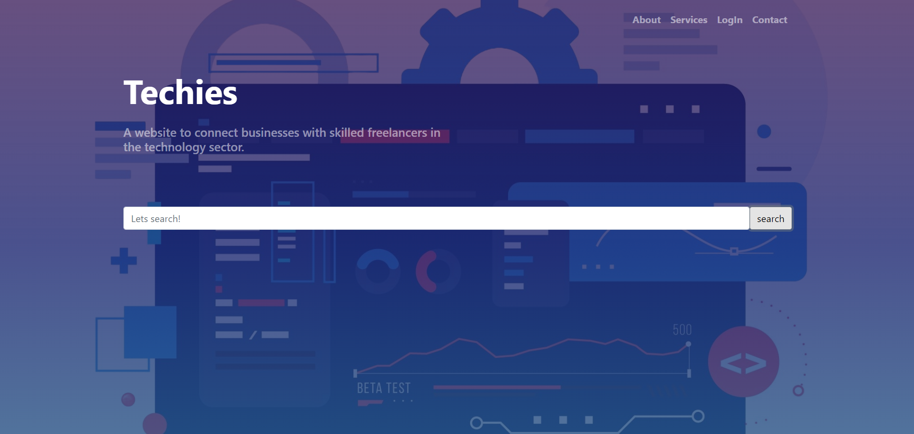
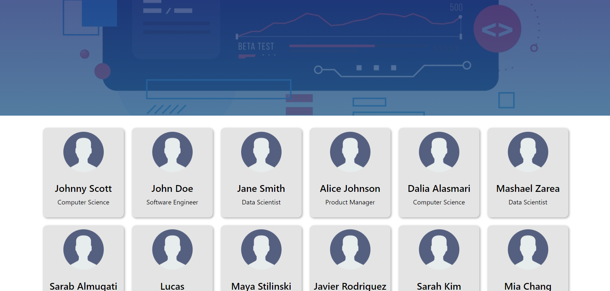
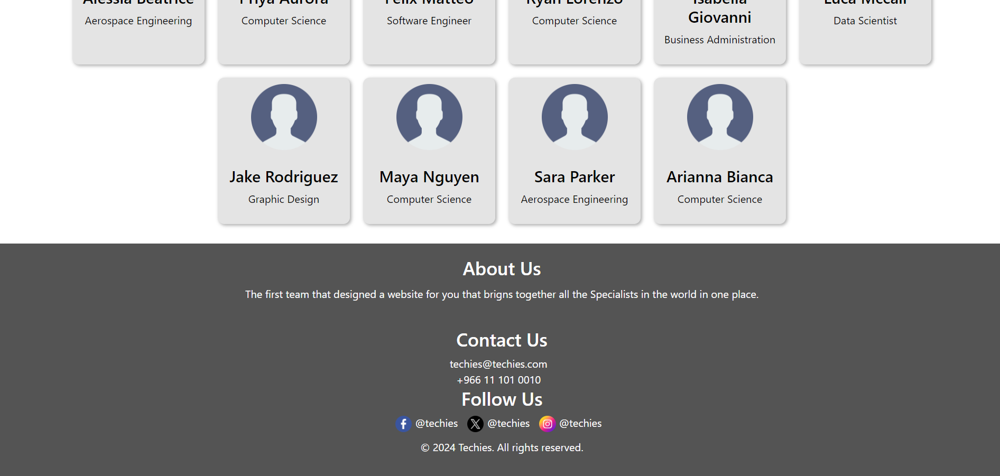
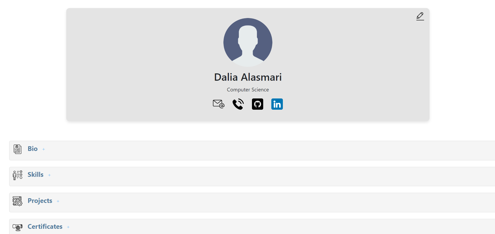
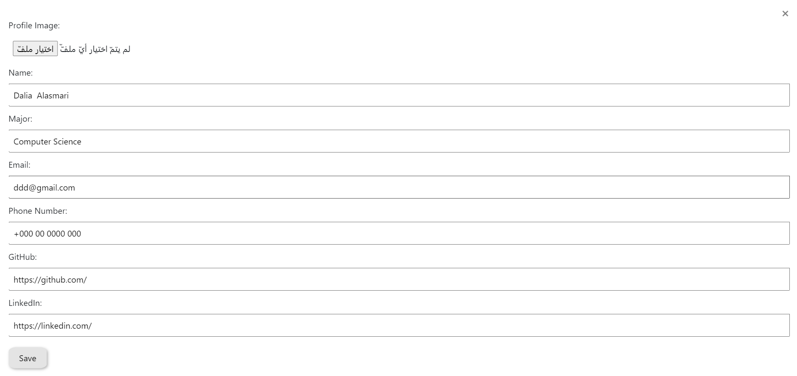
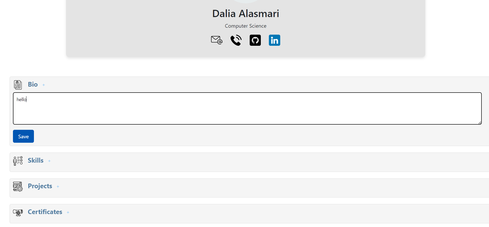
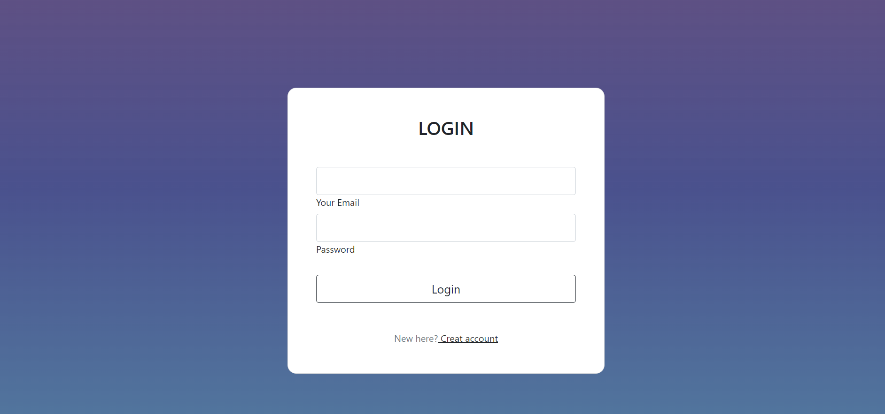
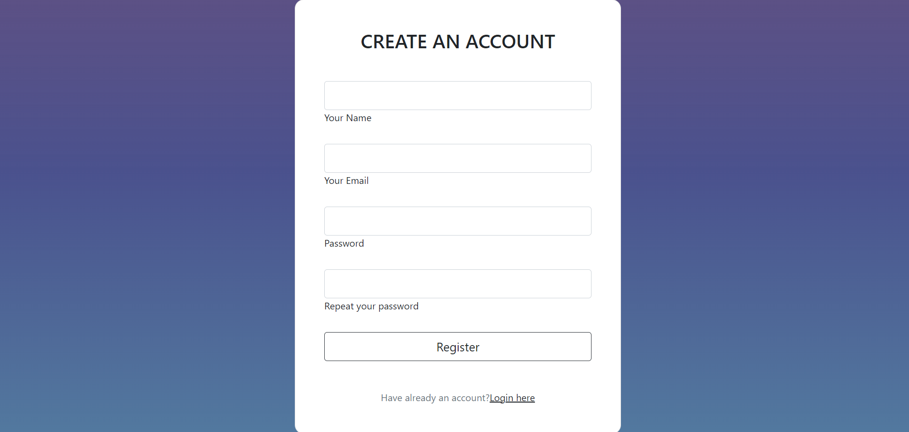

# Techies - Section 371
### Techies is a platform designed to connect businesses with skilled freelancers in the technology sector. Whether you're a business looking for expert developers, designers, or data analysts, or a freelancer seeking exciting projects, Techies has you covered.

 

# Features
- User-Friendly Interface: Easily navigate through projects and profiles with our intuitive design.
- Freelancer Profiles: Freelancers can create profiles with basic information including skills, experience, and portfolio samples.
- Quality Opportunities: efficiently connects freelancers with projects that precisely match their skills and expertise, enabling businesses to swiftly identify the talent they require.

# Flowchart

# Installation
To get started with Techies locally:

1. Clone this repository.
2. Install dependencies with `npm install`
3. Run the development server with `npm start`

# Technologies Used
- ### Frontend
  - HTML/CSS/JavaScript
  - Bootsrap
- ### Backend:
  - Node.js
  - MongoDB
  - Express 
  - REST API

# Screenshots
- ### Main Page

- ### Profile Page

- ### Login/SignUp Page

# Future Work
- Implement real-time messaging functionality.
- Enhance search and filtering options.
- Integrate payment processing for transactions.
- Expand platform to support additional sectors beyond technology.

# Resources
[w3schools](https://www.w3schools.com/).

# Team Members
- Dalia Alasmri
- Sarab Almuqati
- Mashael Zarea
